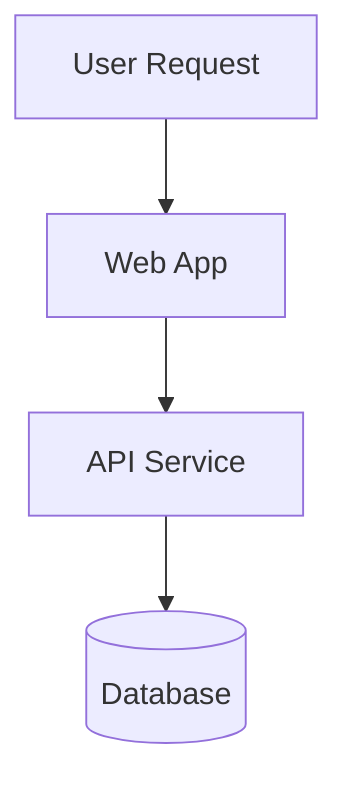
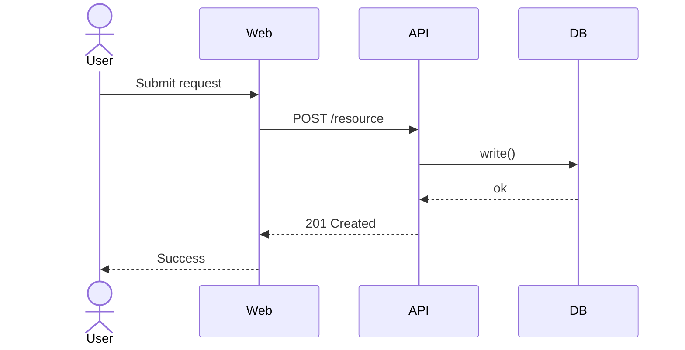

# Mermaid Fallback Templates

## Flowchart

```mermaid
flowchart TD
  A[User Request] --> B[Web App]
  B --> C[API Service]
  C --> D[(Database)]
```

## Sequence

```mermaid
sequenceDiagram
  actor User
  participant Web
  participant API
  participant DB
  User->>Web: Submit request
  Web->>API: POST /resource
  API->>DB: write()
  DB-->>API: ok
  API-->>Web: 201 Created
  Web-->>User: Success
```
