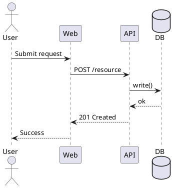

# PlantUML Templates

## C4 Context

```plantuml
@startuml
!include https://raw.githubusercontent.com/plantuml-stdlib/C4-PlantUML/master/C4_Context.puml

Person(user, "User")
System(systemA, "System A", "Feature platform")
System_Ext(systemB, "External System B", "Dependency")

Rel(user, systemA, "Uses")
Rel(systemA, systemB, "Calls")

@enduml
```

## C4 Container

```plantuml
@startuml
!include https://raw.githubusercontent.com/plantuml-stdlib/C4-PlantUML/master/C4_Container.puml

Person(user, "User")
System_Boundary(s1, "Feature System") {
  Container(web, "Web App", "TypeScript", "User interface")
  Container(api, "API Service", "Go", "Business logic")
  ContainerDb(db, "Primary DB", "PostgreSQL", "Persistent store")
}

Rel(user, web, "Uses")
Rel(web, api, "Calls")
Rel(api, db, "Reads/Writes")

@enduml
```

## Sequence


