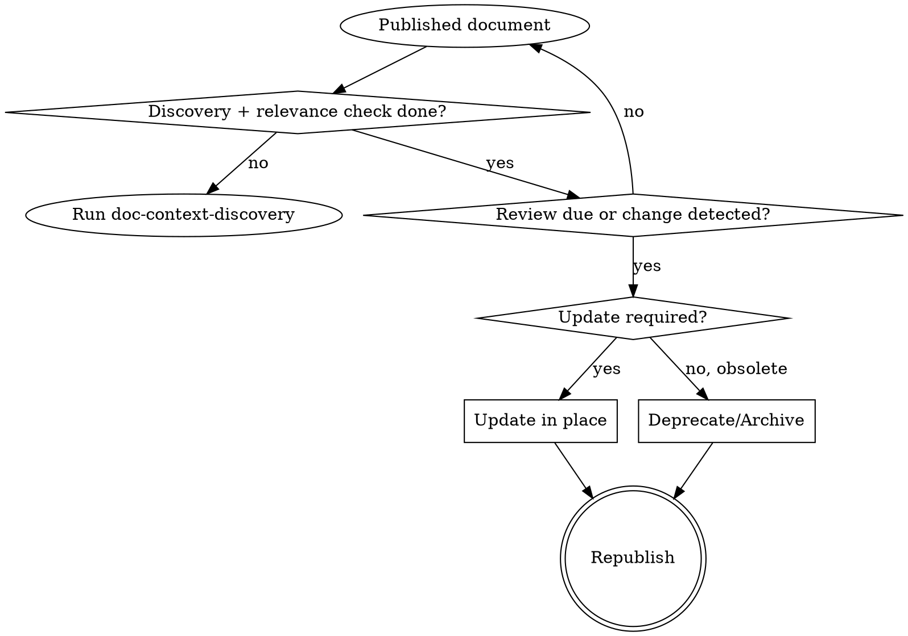

---
name: doc-lifecycle-management
description: Use when maintaining existing documentation over time, including stale detection, controlled updates, and deprecation or archival decisions.
---

# Document Lifecycle Management

## Overview

Keep documentation trustworthy after initial publish.

<HARD-GATE>
Before any update/archive decision, run context discovery and relevance check.
</HARD-GATE>

## Lifecycle States

- `draft`
- `in-review`
- `approved`
- `published`
- `deprecated`
- `archived`

## Maintenance Loop

## Required Checks

- Detect pages with expired `review_date`
- Detect pages impacted by requirement/architecture/API changes
- Detect duplicate or conflicting pages
- Detect low-confidence ownership/status metadata

## Template Reference (Reference-Only for Major Rewrites)

- When a lifecycle update is effectively a major rewrite, consult the matching local `references/*.template.md` for that `doc_type`.
- Use templates as structure guidance only; do not force unnecessary sections for minor updates.

## Change Policy

- Minor change: metadata + content update in place
- Major change: new version with migration notes
- Obsolete docs: deprecate first, archive after grace window

## Archive Safety

Never archive without:

- successor page reference
- approval token
- consumer communication note
