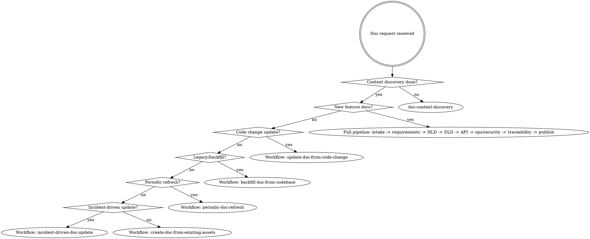

---
name: using-doc-superpowers
description: Use when starting any conversation in this repository to enforce discovery-first workflow routing, Confluence governance, and publication gates before action.
---

<SUBAGENT-STOP>
If you were dispatched as a subagent for a narrow read-only task, skip this skill.
</SUBAGENT-STOP>

<EXTREMELY-IMPORTANT>
If there is even a 1% chance a document skill applies, you MUST invoke it before acting.

If a phase-specific skill applies, you do not have a choice. Use it.
</EXTREMELY-IMPORTANT>

## Instruction Priority

1. User explicit instructions
2. `CLINE.md`
3. `.clinerules/*`
4. Skills in `.cline/skills`
5. Default system behavior

## Mission

Produce enterprise documentation with explicit discovery evidence, gates, and traceability.

No ad-hoc writing.
No out-of-order architecture/design drafting.
No publish without gate evidence.

## Discovery First (Non-Negotiable)

Before any create/update flow:

1. Run `doc-context-discovery`
2. Build keyword-based relevance map from codebase and Confluence
3. Reuse/update existing docs when possible
4. If relevance is low, ask user for pointers before authoring

## Workflow Router

## Diagram Policy

- Use `doc-diagrams-as-code` when diagrams are needed.
- Default: PlantUML.
- Fallback: Mermaid only when rendering/runtime constraints require it.

## Red Flags (Stop Immediately)

- "I can draft HLD first and backfill requirements later"
- "This is small, skip discovery"
- "Create a new page quickly, no need to search"
- "Publish now, review later"
- "Security/ops can be added after release"

All are failures. Return to the correct phase skill.

## Confluence Tool Contract

Read before any Confluence operation:
- `references/confluence-tools.md`

## Required Skill Selection

- Discovery and relevance mapping: `doc-context-discovery`
- Intake and context: `doc-feature-intake`
- Requirements: `doc-requirements-authoring`
- HLD: `doc-hld-authoring`
- DLD: `doc-dld-authoring`
- API/Event contracts: `doc-api-spec-authoring`
- Ops/Reliability/Security: `doc-ops-reliability-security`
- Diagram authoring: `doc-diagrams-as-code`
- Gate verification: `doc-traceability-and-gates`
- Publish/update: `doc-confluence-publishing`
- Lifecycle maintenance: `doc-lifecycle-management`
