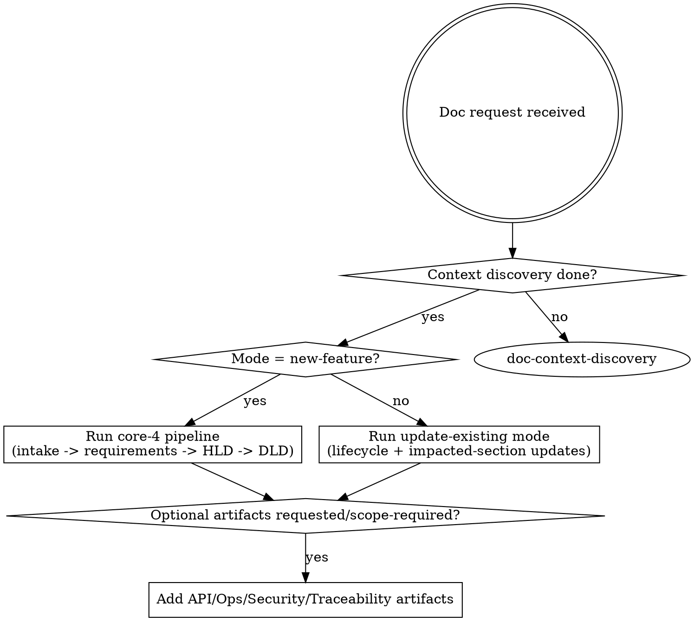

<SUBAGENT-STOP>
If you were dispatched as a subagent for a narrow read-only task, skip this skill.
</SUBAGENT-STOP>

<EXTREMELY-IMPORTANT>
If there is even a 1% chance a document skill applies, you MUST invoke it before acting.

If a phase-specific skill applies, you do not have a choice. Use it.
</EXTREMELY-IMPORTANT>

## Instruction Priority

1. User explicit instructions
2. `.clinerules/superpowers.md`
3. This skill (`using-doc-superpowers`) as workflow bootstrap
4. `.clinerules/workflows/document-management.md`
5. Other skills in `.cline/skills`
6. Default system behavior

## Mission

Produce enterprise documentation with explicit discovery evidence, gates, and traceability.

No ad-hoc writing.
No out-of-order architecture/design drafting.
No publish without gate evidence.
Single workflow entrypoint: `document-management`.
Workflow modes:
- `new-feature`: core-4 (`feature-brief -> requirements -> hld -> dld`)
- `update-existing`: update impacted docs from codebase + existing docs + user request
Optional artifacts (API/Ops/Security/Traceability/Release-readiness/ADR) are added only when requested or scope requires.

## Runtime Rule Source

- Single rule source is `.clinerules/superpowers.md`.
- This skill executes workflow logic under that rule source.
- Avoid duplicating policy in mirror documents.

## Runtime Boundary

- Runtime instruction surface: `.cline/*` and `.clinerules/*`.
- Root/docs markdown files are user-facing reference material unless explicitly pulled in by a runtime rule or user request.

## Template Reference Policy

Before any authoring phase, consult the matching local template in this skill's `references/*`.

Templates are reference-only:

- Use them as structure/checklist guidance.
- Adapt sections to the actual feature scope.
- Do not copy unresolved placeholders (`TBD`, `TODO`) into final documents.

Template mapping:

- `doc-feature-intake` -> `references/feature-brief.template.md`
- `doc-requirements-authoring` -> `references/requirements.template.md`
- `doc-hld-authoring` -> `references/hld.template.md`
- `doc-dld-authoring` -> `references/dld.template.md`
- `doc-api-spec-authoring` -> `references/api-spec.template.md`
- `doc-ops-reliability-security` -> `references/ops-runbook.template.md`, `references/security-model.template.md`
- `doc-traceability-and-gates` -> `references/traceability.template.md`

## Agent Execution Topology (Capability Contract)

Treat this section as machine-operational policy. It defines delegation boundaries and a forward-compatible upgrade path.

### Role Contract

| Role | Primary Responsibility | Allowed Operations | Disallowed Operations | Mandatory Deliverable |
|---|---|---|---|---|
| `main-agent` | Orchestrate full documentation lifecycle | discovery routing, authoring, validation, gates, Confluence publish/update, metadata/status transitions | none (subject to platform and user policy) | final approved artifact set + gate decision |
| `subagent-research` | Parallel evidence collection only | read files, list/search symbols, read-only command execution, skill-assisted analysis | file writes, patching, MCP calls, Confluence operations, browser/web search, spawning nested subagents | bounded research memo with file/path evidence |

### Subagent Capability Levels (Future Compatibility Layer)

Do not rewrite workflow logic when platform capabilities change. Use level-based gating:

- `R0` (default/current): read-only research only
- `R1` (reserved): read + local file edits (no MCP)
- `R2` (reserved): read + local file edits + MCP tool use
- `R3` (reserved): near-full parity with main-agent

Unless explicitly overridden by runtime/platform evidence, assume `SUBAGENT_CAPABILITY_LEVEL=R0`.

### Delegation Routing Algorithm

For every workflow step, classify task type:

1. `research` (discovery, indexing, evidence extraction)
2. `authoring` (requirements/HLD/DLD/API/Ops content generation and edits)
3. `governance` (traceability gates, status decisions, metadata integrity)
4. `publish` (Confluence upsert/move/archive/review tasks)

Assignment rules:

- If task type is `authoring`, `governance`, or `publish`: assign to `main-agent` by default.
- If task type is `research`: may assign to `subagent-research`.
- If future platform upgrades subagent capability, only relax assignment if capability level satisfies required operation set.
- Even at higher future levels, `GO-PUBLISH` decision remains a main-agent responsibility unless user explicitly authorizes otherwise.

### Reserved Upgrade Hooks (Do Not Delete)

Keep these reserved switches in policy text so future upgrades require configuration change, not document redesign:

- `SUBAGENT_CAPABILITY_LEVEL`
- `ALLOW_SUBAGENT_AUTHORING` (default `false`)
- `ALLOW_SUBAGENT_MCP` (default `false`)
- `ALLOW_SUBAGENT_PUBLISH` (default `false`)

## Discovery First (Non-Negotiable)

Before any create/update flow:

1. Run `doc-context-discovery`
2. Build keyword-based relevance map from codebase and Confluence
3. Reuse/update existing docs when possible
4. If relevance is low, ask user for pointers before authoring

## Single Workflow Router

Use only `.clinerules/workflows/document-management.md`.

## Diagram Policy

- Use `doc-diagrams-as-code` when diagrams are needed.
- Default: PlantUML.
- Fallback: Mermaid only when rendering/runtime constraints require it.

## Red Flags (Stop Immediately)

- "I can draft HLD first and backfill requirements later"
- "This is small, skip discovery"
- "Create a new page quickly, no need to search"
- "Publish now, review later"
- "Security/ops are in scope but can be added after release"

All are failures. Return to the correct phase skill.

## Confluence Tool Contract

Read before any Confluence operation:
- `references/confluence-tools.md`

## Required Skill Selection

- Discovery and relevance mapping: `doc-context-discovery`
- Intake and context: `doc-feature-intake`
- Requirements: `doc-requirements-authoring`
- HLD: `doc-hld-authoring`
- DLD: `doc-dld-authoring`
- API/Event contracts (optional): `doc-api-spec-authoring`
- Ops/Reliability/Security (optional): `doc-ops-reliability-security`
- Diagram authoring: `doc-diagrams-as-code`
- Gate verification (optional governance): `doc-traceability-and-gates`
- Publish/update: `doc-confluence-publishing`
- Lifecycle maintenance: `doc-lifecycle-management`
